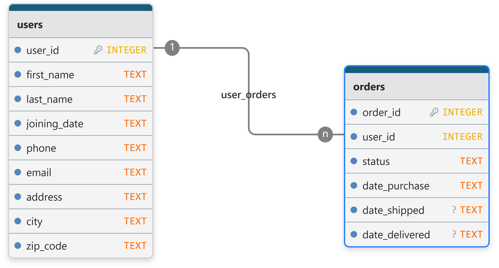
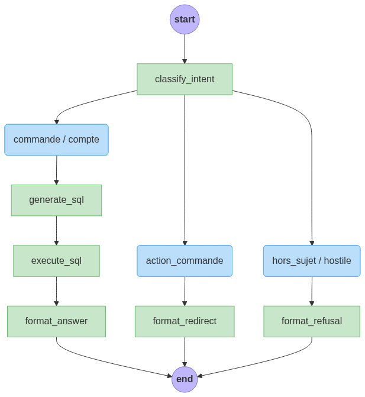

# Customer Service Assistant

> Assistant service client Text-to-SQL — répond aux questions sur commandes et compte client en langage naturel.


<!--  -->

---

## Présentation

L'assistant reçoit une question en français, identifie son intention, génère la requête SQL adaptée, l'exécute sur la base client, puis reformule la réponse en langage naturel. Deux backends LLM sont disponibles : l'API Mistral (mode cloud) ou un modèle quantisé local. L'accès aux données est strictement cloisonné par `user_id` — aucune requête ne peut exposer les données d'un autre client.

## Fonctionnalités

- Interrogation des commandes en langage naturel (statut, dates, historique)
- Accès aux informations du compte client (adresse, email, téléphone)
- Redirection vers un conseiller humain pour les demandes d'action (annulation, retour, réclamation)
- Refus et détection des tentatives d'injection de prompt ou d'accès inter-clients
- Historique de conversation multi-tours via LangGraph `MemorySaver`
- Deux stratégies de classification d'intention : LLM structuré ou embeddings sémantiques

## Base de données



La base SQLite (`data/raw/orders.db`) contient deux tables :

**`users`** — profil client (40 lignes en jeu de données de démonstration)

| Colonne | Type | Description |
|---|---|---|
| `user_id` | INTEGER PK | Identifiant unique |
| `first_name`, `last_name` | TEXT | Nom du client |
| `joining_date` | TEXT | Date d'inscription (ISO 8601) |
| `phone`, `email` | TEXT | Coordonnées |
| `address`, `city`, `zip_code` | TEXT | Adresse postale |

**`orders`** — commandes (100 lignes en jeu de données de démonstration)

| Colonne | Type | Description |
|---|---|---|
| `order_id` | INTEGER PK | Identifiant commande |
| `user_id` | INTEGER FK | Référence client |
| `status` | TEXT | `invoiced` \| `shipped` \| `delivered` |
| `date_purchase` | TEXT | Date d'achat (ISO 8601) |
| `date_shipped` | TEXT \| NULL | Date d'expédition (null si `invoiced`) |
| `date_delivered` | TEXT \| NULL | Date de livraison (null si non livré) |

Le schéma de référence est disponible dans [`docs/schema.sql`](docs/schema.sql).

## Structure du projet

```
.
├── assets/                  # Ressources statiques (graphe du pipeline)
├── data/
│   └── raw/orders.db        # Base SQLite (gitignored)
├── docs/                    # Documentation, schémas SQL
├── src/
│   ├── app.py               # Interface Streamlit
│   ├── chain/               # Graphe LangGraph, classification, prompts
│   ├── db/                  # Couche SQLAlchemy (lecture seule)
│   ├── llm/                 # Factory et backends LLM
│   └── prompt/              # Prompts YAML versionnés
├── tests/                   # Tests unitaires
├── Dockerfile
└── pyproject.toml
```

## Architecture de la partie langchain



Le pipeline suit trois chemins selon l'intention détectée :

- **commande / compte** pour les demandes légitimes auxquelles l'assistant peut répondre → génération SQL → exécution → reformulation en langage naturel
- **action_commande** pour les demandes légitimes auxquelles l'assistant ne peut pas répondre → redirection vers un conseiller avec numéro de contact
- **hors_sujet / hostile** pour les demandes inappropriées → refus poli ou rejet sans réponse

## Stack technique

| Composant | Outil |
|---|---|
| Interface | Streamlit |
| Orchestration LLM | LangGraph |
| LLM (cloud) | Mistral AI via `langchain-mistralai` |
| LLM (local) | HuggingFace Transformers + quantisation FP8 |
| Classification sémantique | `sentence-transformers` |
| Base de données | SQLite (SQLAlchemy, mode lecture seule) |
| Validation | Pydantic |
| Gestionnaire de paquets | uv |
| Qualité | Ruff, mypy, pytest, pre-commit |
| CI | GitHub Actions |
| Conteneurisation | Docker |

## Prérequis

- Python 3.11+
- [uv](https://docs.astral.sh/uv/) installé
- Une clé API Mistral (backend `api`) — ou un GPU avec au moins 16 Go de VRAM (backend `local`)

## Installation

```bash
git clone https://github.com/arnaud-dg/Customer_Service_Assistant_Project_Blent.git
cd customer-service-assistant

# Dépendances de développement
uv sync --extra dev

# Variables d'environnement
cp .env.example .env
# Renseigner au minimum MISTRAL_API_KEY et DB_PATH
```

Pour le backend local (modèle quantisé, téléchargement ~15 Go) :

```bash
uv sync --extra dev --extra local
```

## Lancer l'application

```bash
uv run streamlit run src/app.py
```

L'interface est accessible sur `http://localhost:8501`.

### Via Docker

```bash
docker build -t customer-service-assistant .

docker run -p 8501:8501 \
  -v $(pwd)/data:/app/data \
  --env-file .env \
  customer-service-assistant
```

## Tests unitaires

```bash
# Suite complète
uv run pytest

# Avec rapport de couverture
uv run pytest --cov=src --cov-report=term-missing
```

Les tests couvrent la validation SQL (sécurité et cloisonnement), le classificateur sémantique et le chargement des prompts YAML.

## Tests métiers

Le fichier validation.py permet de lancer un test de validation sur 
60 questions de référence (src/prompt/golden_dataset_v1.0.yaml) vérifiées humainement.

## Auteur

**Arnaud Duigou** — [arnaud.duigou@data-boost.fr](mailto:arnaud.duigou@data-boost.fr)

## Licence

MIT — voir [LICENSE](./LICENSE).
