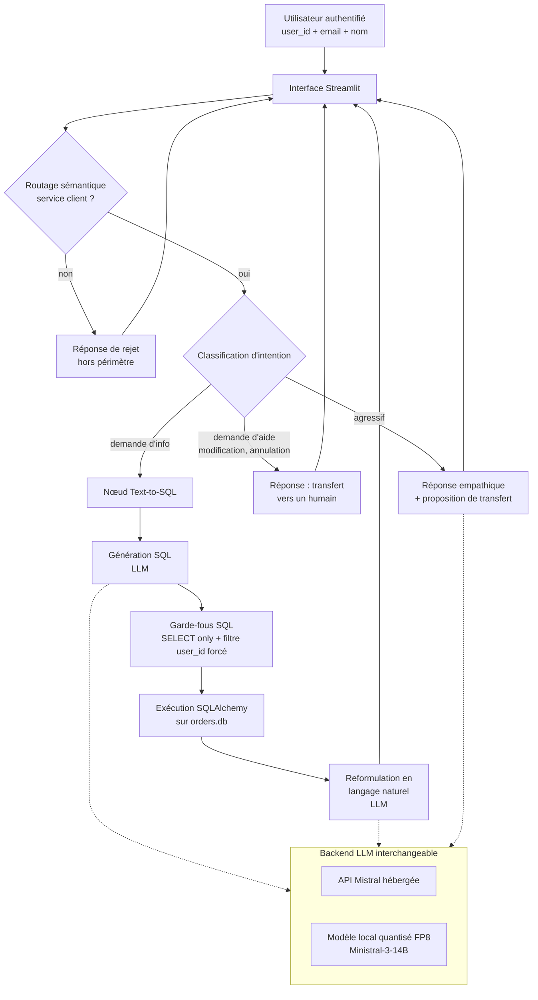

# Architecture

## Contexte

Assistant conversationnel de service client pour un e-commerçant. Le bot dialogue avec un client authentifié (identifié par `user_id`, nom, prénom, email) et répond à des questions sur ses commandes (en cours ou passées) en interrogeant une base SQLite via une chaîne text-to-SQL.

## Principes directeurs

1. **Isolation utilisateur stricte** : le `user_id` de session n'est jamais lu depuis le prompt, ni déduit par le LLM. Il est injecté côté code et appliqué comme filtre obligatoire à toute requête SQL générée.
2. **Routage avant LLM** : les questions hors-sujet sont rejetées avant tout appel coûteux au LLM (routage sémantique léger).
3. **LLM interchangeable** : deux backends supportés derrière une interface commune, sélection par variable d'environnement (`LLM_BACKEND=api|local`).
4. **Séparation des responsabilités** : génération SQL, exécution, formatage de la réponse en langage naturel sont des étapes distinctes, testables séparément.

## Vue d'ensemble



## Composants

### 1. Interface (Streamlit)

- Fichier : `src/app.py`
- Rôle : interface chat web, gestion de l'état conversationnel par session.
- Charge le `SESSION_USER_ID` depuis `.env` (simule un utilisateur authentifié).
- Affiche les informations du profil et l'historique des échanges.

### 2. Couche LLM (`src/llm/`)

- Interface commune `BaseLLM` (méthodes `invoke`, `stream`).
- Deux implémentations :
  - `MistralAPILLM` : wrapper `langchain_mistralai.ChatMistralAI`.
  - `MistralLocalLLM` : wrapper autour de `Mistral3ForConditionalGeneration` chargé en FP8 via `FineGrainedFP8Config(dequantize=True)`, exposé sous la forme d'un `BaseChatModel` LangChain pour rester compatible avec le reste de la chaîne.
- Factory `get_llm()` qui lit `LLM_BACKEND` et renvoie l'instance correspondante.

### 3. Couche base de données (`src/db/`)

- `engine.py` : création du `SQLAlchemy Engine` SQLite (lecture seule recommandée via `mode=ro`).
- `schema.py` : représentation déclarative des tables `users` et `orders` (utile pour la validation, pas pour les écritures).
- `queries.py` : exécution sécurisée de requêtes paramétrées, helpers de mapping statut → libellé.

### 4. Graphe conversationnel (`src/bot/`)

Squelette LangGraph minimal pour démarrer. La structure est prévue pour accueillir progressivement les nœuds décrits ci-dessus.

État partagé du graphe :

```python
class BotState(TypedDict):
    user_id: int            # injecté côté serveur, jamais depuis le prompt
    user_profile: dict      # nom, prénom, email
    question: str           # message utilisateur courant
    intent: str | None      # info | help | offtopic | hostile
    sql: str | None         # requête générée, après garde-fous
    rows: list[dict] | None # résultat brut
    answer: str | None      # réponse en langage naturel
```

Nœuds prévus (à implémenter au fil des étapes) :

| Nœud | Étape projet | Rôle |
|---|---|---|
| `semantic_router` | 3 | Filtre hors-sujet, court-circuite le graphe |
| `classify_intent` | 2 | Détecte info / aide / hostile |
| `generate_sql` | 1 | LLM produit un `SELECT` |
| `guard_sql` | 3 | Force `SELECT` only, vérifie `WHERE user_id = ?`, blanchit la requête |
| `execute_sql` | 1 | SQLAlchemy + paramètre `user_id` |
| `format_answer` | 1 | LLM reformule en langage naturel avec libellés humains |
| `human_handoff` | 2 | Réponse de transfert |

Dans la version minimale livrée maintenant : un seul flux linéaire `generate_sql → guard_sql → execute_sql → format_answer`, sans routage ni classification. Les autres nœuds seront ajoutés ensuite.

### 5. Garde-fous (`src/security/`)

- `sql_guard.py` :
  - Parse l'AST SQL (via `sqlglot`) pour valider que la requête est un `SELECT` unique.
  - Vérifie que les tables référencées sont dans une whitelist (`users`, `orders`).
  - Injecte ou vérifie la présence d'un prédicat `users.user_id = :user_id` / `orders.user_id = :user_id`.
- `prompt_templates.py` : prompts système qui n'incluent que les colonnes autorisées et qui n'exposent jamais d'autres `user_id`.
- `semantic_router.py` : classification rapide « service client / autre » (à implémenter à l'étape 3, peut s'appuyer sur des embeddings ou un petit modèle).

## Flux d'une requête (cas nominal, étape 1 minimale)

1. L'utilisateur tape une question dans Streamlit.
2. `BotState` est initialisé avec `user_id`, profil et question.
3. `generate_sql` appelle le LLM avec le schéma + la question + l'instruction d'utiliser `:user_id` comme paramètre.
4. `guard_sql` valide la requête, ajoute un filtre `user_id` si manquant, refuse sinon.
5. `execute_sql` exécute via SQLAlchemy en passant `user_id` en paramètre lié.
6. `format_answer` demande au LLM une réponse naturelle en français, en traduisant les statuts (`invoiced` → « validée et payée, en attente d'expédition », `shipped` → « expédiée », `delivered` → « livrée »).
7. La réponse est rendue dans le chat.

## Décisions techniques

- **SQLite en lecture seule** par défaut (`?mode=ro&uri=true`). Le bot n'a aucun besoin d'écrire.
- **Paramètres liés** systématiques pour le `user_id`. Pas d'interpolation de chaînes.
- **`sqlglot`** plutôt qu'une regex pour valider le SQL : plus robuste face aux variations de syntaxe.
- **Backend LLM dual via env var** : le code applicatif ne connaît que l'interface, pas l'implémentation. Permet de basculer API ↔ local sans changer la chaîne.

## Hors périmètre (version actuelle)

- Modifications de données utilisateur ou de commandes.
- Authentification réelle (le `user_id` vient de `.env`).
- Historique conversationnel multi-tours côté SQL (chaque question est traitée indépendamment).
- Multi-tenant / multi-base.
