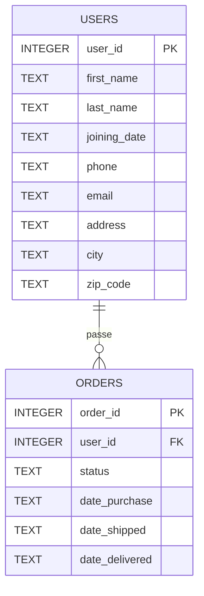

# Schéma de la base `orders.db`

Base relationnelle SQLite, deux tables, aucun trigger.

## Diagramme

## Table `users`

40 lignes. Représente les clients.

| Colonne | Type | Contraintes | Description |
|---|---|---|---|
| `user_id` | INTEGER | PK | Identifiant unique du client |
| `first_name` | TEXT | NOT NULL | Prénom |
| `last_name` | TEXT | NOT NULL | Nom |
| `joining_date` | TEXT | NOT NULL | Date d'inscription, ISO 8601 (`YYYY-MM-DD HH:MM:SS`) |
| `phone` | TEXT |  | Téléphone, format français à 10 chiffres |
| `email` | TEXT | NOT NULL | Courriel |
| `address` | TEXT |  | Adresse postale ligne 1 |
| `city` | TEXT |  | Ville |
| `zip_code` | TEXT |  | Code postal (conservé en texte pour préserver les zéros initiaux) |

Index : `idx_users_email` sur `email`.

## Table `orders`

100 lignes. Une commande par ligne, rattachée à un client par `user_id`.

| Colonne | Type | Contraintes | Description |
|---|---|---|---|
| `order_id` | INTEGER | PK | Identifiant unique de la commande |
| `user_id` | INTEGER | NOT NULL, FK → `users.user_id` | Client propriétaire |
| `status` | TEXT | NOT NULL | Statut applicatif (voir ci-dessous) |
| `date_purchase` | TEXT | NOT NULL | Date d'achat, ISO 8601 |
| `date_shipped` | TEXT |  | Date d'expédition, NULL si non expédiée |
| `date_delivered` | TEXT |  | Date de livraison, NULL si non livrée |

Index : `idx_orders_user_id` sur `user_id`, `idx_orders_status` sur `status`.

### Valeurs de `status`

Énumération applicative (non contrainte au niveau SQL pour rester fidèle à la base fournie). Le bot doit traduire ces codes en langage naturel avant d'adresser la réponse au client.

| Code SQL | Libellé client | Sémantique |
|---|---|---|
| `invoiced` | Validée et payée, en attente d'expédition | La commande a été enregistrée et le paiement encaissé. Elle n'a pas encore quitté l'entrepôt. |
| `shipped` | Expédiée, en cours de livraison | Le colis a quitté l'entrepôt. Le client ne l'a pas encore reçu. |
| `delivered` | Livrée | Le client a reçu son colis. |

### Invariants attendus

- `status = 'invoiced'` ⇒ `date_shipped IS NULL` et `date_delivered IS NULL`
- `status = 'shipped'` ⇒ `date_shipped IS NOT NULL` et `date_delivered IS NULL`
- `status = 'delivered'` ⇒ `date_shipped IS NOT NULL` et `date_delivered IS NOT NULL`
- `date_shipped >= date_purchase` quand non null
- `date_delivered >= date_shipped` quand non null

Ces invariants ne sont pas garantis par le schéma : à vérifier dans un script de qualité de données si besoin.

## Conventions d'usage côté bot

- Toute requête générée par le LLM doit comporter un filtre `WHERE user_id = :user_id`, où `:user_id` est lié côté code à la session courante.
- Le bot n'a aucun droit d'écriture sur la base. La connexion SQLAlchemy est ouverte en mode `ro` (`file:...?mode=ro&uri=true`).
- Les seules colonnes exposables au client sont celles de ses propres lignes. Aucune jointure ou agrégation ne doit révéler de données d'un autre `user_id`.
